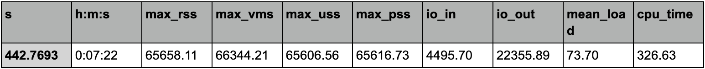
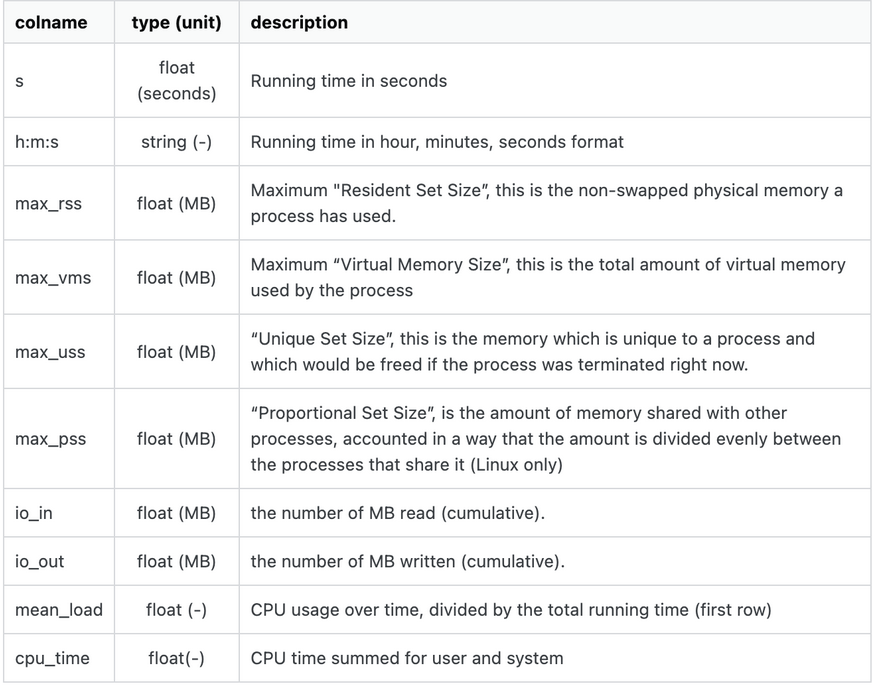

## Task

You are given the benchmark outputs for a Snakemake pipeline running on a HPC cluster. Based on the benchmarks, optimize the SBATCH script to better reflect the resources and time needed to execute this pipeline on the given cluster. 

